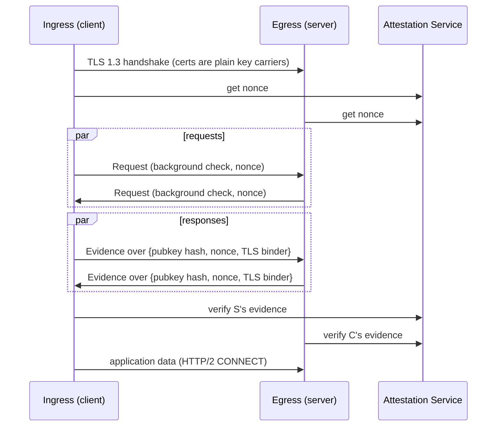

# RATS-TLS Attestation Exchange

Every `rats_tls` connection starts with a normal TLS 1.3 handshake using self-signed certificates that only carry keys. Before any application data, both ends then run a short exchange over the TLS stream. First, each end sends a request saying what it needs from the peer: nothing, background-check evidence (with a nonce from its own attestation service), or a passport token. Then each end answers the peer's request with an ack, evidence, a token, or an error. The two directions are independent, so one-way and mutual attestation use the same exchange.

Evidence and tokens carry the hash of the attester's certificate public key, so they are tied to the key used in the handshake. Background-check evidence also carries the verifier's nonce and a binder derived from the TLS exporter, which ties it to this specific connection. Passport tokens are not bound to the connection and may be reused until they expire. The connection proceeds only if the verifier gets back the kind of response it asked for and it verifies against the claims the verifier expects.

The exchange adds latency when a new connection is set up: one extra round trip between the peers for the exchange itself, plus the attestation calls for the chosen mode (for background check, a nonce fetch and a verify call to the verifier's attestation service and a quote from the attester's attestation agent).

